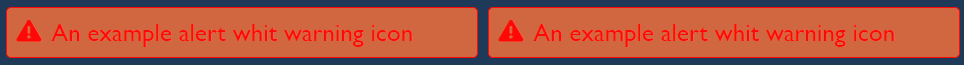
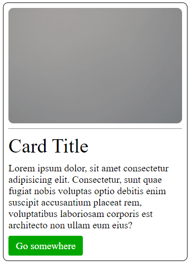
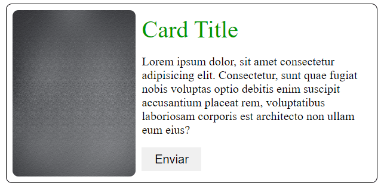
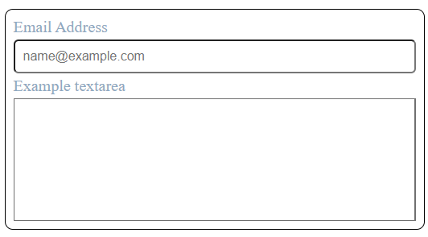

<h1 align="center">DOCUMENTACIÓN - GAMESTATION</h1>

## Tabla de contenido

- [Descripción general](#Descripción-general)
  - [Indicaciones](#Indicaciones)
  - [Como usar la libreria](#como-usar-la-libreria)
  - [Descripción del proyecto](#Descripción-del-proyecto)
  - [Nombre de la librería](#Nombre-de-librería)
  - [Versión del proyecto](#Versión-del-proyecto)
  - [Enlaces](#Enlaces)
  - [Que incluye](#que-incluye)
  - [Documentación](#Documentación)
  - [Elementos creados con la libreria](#Elemntos-creados-con-la-libreria)
- [Procesos](#Procesos)
  - [Construido con](#Construido-con)
  - [Herramientas utilizadas](#Herramientas-utilizadas)
- [Desarrolladores](#Desarrolladores)

## Descripción general

## Indicaciones

Si desea utilizar nuestra libreria es necesario conocer que procesos se deben de seguir, para poder hacer uso correcto de la libreria.

- Primero necesitamos descargar la libreria, [Pulse para iniciar descarga](https://github.com/AlexanderPortillo/GameStation/archive/refs/heads/main.zip), luego de haberla descargado es necesario desconprimir el achivo que se genera, veras una carpeta a la hora de descomprimir y a la hora de entrar en esta misma habran otras carpetas donde se encuentran distintos elementos de la libreria por lo cual te dare una lista de carpetas y elementos que puedes eliminar sin que se afecte la libreria, primero puedes empezar eliminando la carpeta HTML si asi lo desea, esta contiene diferentes elementos, como por ejemplo, alerts, badges, buttons, cards, container entre otros elementos, la siguiente carpeta que puedes eliminar es la de de Img ya que en esta solo se encuentran unas imagenes utilizadas unicamente para un diseño en especifico y la ultima carpeta que puedes eliminar es la que se llama Design ya que en esta solo se encuentran capturas de distintos elementos creados.

- Lista de carpetas que no se deben borrar o modificarr, la primera seria la carpeta que se llama Scss esta misma no se debe de modificar ni de eliminar ya que ahi se encuentran la mayoria de elementos, si en un futuro desea agregar un elemnto nuevo y esta carpeta no se encuentra sera imposible agregar algo nuevo, otra carpeta que no se debe de tocar es la de Css, ya que aqui se encuentra la compilacion de los elementos creados en la carpeta Scss, ojo el unico archivo que no se puede eliminar de esta carpeta es el style.css y el style.css.map ya que es esta estan todos los elementos, si usted desea eliminar los otros archivos que se encuentran en esta carpeta, no hay problema alguno en hacerlo.

- Despues de haber aclarado todo lo anterior, podemos empezar a decirte como hacer uso de la libreria, como podras ver en el archivo descargado se encuentra un archivo index.html, puedes borrar todo lo que se muestra en el y agregar las siguientes lineas que se muetran, ahora puedes empezar a hacer uso de la libreria, sigue leyendo la documentacion para que te des cuenta de que se puede crear con la libreria.

```Html
<!DOCTYPE html>
<html lang="en">

<head>
    <meta charset="UTF-8">
    <meta http-equiv="X-UA-Compatible" content="IE=edge">
    <meta name="viewport" content="width=device-width, initial-scale=1.0">
    <!-- CSS only -->
    <link rel="stylesheet" href="./Css/style.css">
    <title>GameStation</title>
</head>

<body>

</body>

</html>
```

## Descripción del proyecto

- La página estará centrada en mostrar información acerca de juegos en actualidad y próximos a salir.

## Nombre de la librería

- Game Station

## Versión del proyecto

- versión 0.1

## Enlaces

- Repositorio URL: [GitHub](https://github.com/AlexanderPortillo/GameStation.git)
- Sitio en vivo URL: [GitHub Page]()

## Que incluye

Dentro de la descarga, encontrará los siguientes directorios y archivos, que agrupan lógicamente los activos comunes y brindan variaciones tanto compiladas como minimizadas y tambien encontrará un par de ejemplos demostrando el uso de la libreria.

<details>
  <summary>Ver contenido</summary>

```text
GameStation/
├── css/
│   ├── alerts.css
│   ├── alerts.css.map
│   ├── badges.css
│   ├── badges.css.map
│   ├── border-radius.css
│   ├── border-radius.css.map
│   ├── box-shadow.css
│   ├── box-shadow.css.map
│   ├── btn.css
│   ├── btn.css.map
│   ├── cards.css
│   ├── cards.css.map
│   ├── colors.css
│   ├── colors.css.map
│   ├── containers.css
│   ├── containers.css.map
│   ├── flexBox.css
│   ├── flexBox.css.map
│   ├── font-size.css
│   ├── font-size.css.map
│   ├── form.css
│   ├── form.css.map
│   ├── margin-padding-border.css
│   ├── margin-padding-border.css.map
│   ├── navbars.css
│   ├── navbars.css.map
│   ├── reset.css
│   ├── reset.css.map
│   ├── style.css
│   └── style.css.map
└── Html/
    ├── alerts.html
    ├── badges.html
    ├── buttons.html
    ├── cards.html
    ├── containers.html
    ├── form.html
    ├── navbar.html
    └── row-col.html
```

</details>

## Documentación

| Clases                        | Etiquetas que representa la clase   | unidad | Descripción                                         |
| ----------------------------- | ----------------------------------- | ------ | --------------------------------------------------- |
| `alert`                       | Sin representacion                  | -      | Alerta simple                                       |
| `alert-warning`               | Sin representacion                  | -      | Alerta de advertencia                               |
| `alert-succes`                | Sin representacion                  | -      | Alerta de éxito                                     |
| `alert-succes`                | Sin representacion                  | -      | Alerta de éxito                                     |
| `alert-link`                  | Sin representacion                  | -      | Alerta de enlace                                    |
| `alert-normal`                | Sin representacion                  | -      | Alerta simple                                       |
| `badges`                      | Sin representacion                  | -      | Insignia simple                                     |
| `badges-indigo`               | Sin representacion                  | -      | Insignia simple color indigo                        |
| `badges-olive`                | Sin representacion                  | -      | Insignia simple color aceituna                      |
| `badges-paynes`               | Sin representacion                  | -      | Insignia simple color peyne                         |
| `badges-red`                  | Sin representacion                  | -      | Insigna simple color rojo                           |
| `circle-1`                    | border-radius                       | px     | Borde redondo de los 4 lados                        |
| `circle-t-l-1`                | border-top-left-radius              | px     | Borde redondo arriba-izquierda                      |
| `circle-t-r-1`                | border-top-right-radius             | px     | Borde redondo arriba-derecha                        |
| `circle-b-l-1`                | border-bottom-left-radius           | px     | Borde redondo abajo-izquierda                       |
| `circle-b-r-1`                | border-bottom-right-radius          | px     | Borde redondo abajo-derecha                         |
| `box-s-cg-1`                  | box-shadow                          | px     | Sombreado color gris cadete                         |
| `box-s-cg-h-1`                | box-shadow                          | px     | Sombreado con transicion gris cadete                |
| `box-s-id-1`                  | box-shadow                          | px     | Sombreado color tinte índigo                        |
| `box-s-id-h-1`                | box-shadow                          | px     | Sombreado con transicion tinte índigo               |
| `box-s-pb-1`                  | box-shadow                          | px     | Sombreado color azul prusiano                       |
| `box-s-pb-h-1`                | box-shadow                          | px     | Sombreado color transicion azul prusiano            |
| `btn`                         | Sin representacion                  | -      | Boton simple                                        |
| `btn-gold`                    | Sin representacion                  | -      | Boton simple color paney gris                       |
| `btn-prusian`                 | Sin representacion                  | -      | Boton simple color azul prusiano                    |
| `btn-kelly`                   | Sin representacion                  | -      | Boton simple color kelly Verde                      |
| `btn-blue`                    | Sin representacion                  | -      | Boton simple color azul                             |
| `btn-h`                       | Sin representacion                  | -      | Boton de transicion de fondo                        |
| `btn-h-x`                     | Sin representacion                  | -      | Boton de transicion color de fuente                 |
| `card`                        | Sin representacion                  | -      | Tarjeta simple completa                             |
| `card-img`                    | Sin representacion                  | -      | Tarjeta que almacena imagen                         |
| `card-title`                  | Sin representacion                  | -      | Tarjeta que almacena titulo                         |
| `card-text`                   | Sin representacion                  | -      | Tarjeta que alacena texto                           |
| `card-row`                    | Sin representacion                  | -      | Tarjeta orientado a fila                            |
| `color-red`                   | color                               | -      | Color de texto rojo                                 | 
| `color-selective-yellow`      | color                               | -      | Color de texto selectivo amarillo                   |
| `color-olive`                 | color                               | -      | Color de texto aceituna                             |
| `color-forrest-green`         | color                               | -      | Color de texto verde bosque                         |
| `color-dark-pastel-green`     | color                               | -      | Color de texto verde pastel oscuro                  |
| `color-old-gold`              | color                               | -      | Color de texto oro viejo                            |
| `color-white`                 | color                               | -      | Color de texto blanco                               |
| `color-coquelicot`            | color                               | -      | Color de texto coquelicot                           |
| `color-peach`                 | color                               | -      | Color de texto durazno                              |
| `color-sandy-brown`           | color                               | -      | Color de texto marron arena                         |
| `color-black`                 | color                               | -      | Color de texto negro                                |
| `color-bistre`                | color                               | -      | Color de texto bistro                               |
| `color-kelly-green`           | color                               | -      | Color de texto kelly Verde                          |
| `color-drab-dark-brown`       | color                               | -      | Color de texto monótono-marrón oscuro               |
| `color-hunter-green`          | color                               | -      | Color de texto verde cazador                        |
| `color-flame`                 | color                               | -      | Color de texto fuego                                |
| `color-prusian-blue`          | color                               | -      | Color de texto azul prusiano                        |
| `color-indigo-dye`            | color                               | -      | Color de texto tinte indigo                         |
| `color-cadet-gray`            | color                               | -      | Color de texto gris cadete                          |
| `color-engineering-orange`    | color                               | -      | Color de texto ingenieria naranja                   |
| `color-beaer`                 | color                               | -      | Color de texto oso                                  |
| `color-chamoisee`             | color                               | -      | Color de texto gamuza                               |
| `color-satin-sheen-gold`      | color                               | -      | Color de texto oro brillo satinado                  |
| `color-paynes-gray`           | color                               | -      | Color de texto payne gris                           |
| `color-dim-gray`              | color                               | -      | Color de texto gris tenue                           |
| `bg-red`                      | background-color                    | -      | Fondo color rojo                                    | 
| `bg-selective-yellow`         | background-color                    | -      | Fondo color selectivo amarillo                      |
| `bg-olive`                    | background-color                    | -      | Fondo color aceituna                                |
| `bg-forrest-green`            | background-color                    | -      | Fondo color verde bosque                            |
| `bg-dark-pastel-green`        | background-color                    | -      | Fondo color verde pastel oscuro                     |
| `bg-old-gold`                 | background-color                    | -      | Fondo color oro viejo                               |
| `bg-white`                    | background-color                    | -      | Fondo color blanco                                  |
| `bg-coquelicot`               | background-color                    | -      | Fondo color coquelicot                              |
| `bg-peach`                    | background-color                    | -      | Fondo color durazno                                 |
| `bg-sandy-brown`              | background-color                    | -      | Fondo color marrón arena                            |
| `bg-black`                    | background-color                    | -      | Fondo color negro                                   |
| `bg-bistre`                   | background-color                    | -      | Fondo color bistro                                  |
| `bg-kelly-green`              | background-color                    | -      | Fondo color kelly verde                             |
| `bg-drab-dark-brown`          | background-color                    | -      | Fondo color monótono marrón oscuro                  |
| `bg-hunter-green`             | background-color                    | -      | Fondo color verde cazador                           |
| `bg-flame`                    | background-color                    | -      | Fondo color fuego                                   |
| `bg-prusian-blue`             | background-color                    | -      | Fondo color azul prusiano                           |
| `bg-indigo-dye`               | background-color                    | -      | Fondo color tinte índigo                            |
| `bg-cadet-gray`               | background-color                    | -      | Fondo color gris cadete                             |
| `bg-engineering-orange`       | background-color                    | -      | Fondo color ingeniería naranja                      |
| `bg-beaer`                    | background-color                    | -      | Fondo color oso                                     |
| `bg-chamoisee`                | background-color                    | -      | Fondo color gamuza                                  |
| `bg-satin-sheen-gold`         | background-color                    | -      | Fondo color oro brillo satinado                     |
| `bg-paynes-gray`              | background-color                    | -      | Fondo color payne gris                              |
| `bg-dim-gray`                 | background-color                    | -      | Fondo color gris tenue                              |
| `container`                   | Sin representacion                  | -      | Contenedor simple receptivo                         |
| `container-xxl`               | Sin representacion                  | -      | Contenedor para dispositivo grande 1400px           |
| `container-xl`                | Sin representacion                  | -      | Contenedor para dispositivo grande 1200px           |
| `container-ld`                | Sin representacion                  | -      | Contenedor para dispositivo grande 992px            |
| `container-md`                | Sin representacion                  | -      | Contenedor para dispositivo mediano 768px           |
| `container-sd`                | Sin representacion                  | -      | Contenedor para dispositivo pequeño 576px           |
| `center-content`              | Sin representacion                  | -      | Centra contenido en toda la pantalla                |
| `d-center`                    | Sin representacion                  | -      | Contenedor que centra contenido                     |
| `d-flex`                      | display: flex                       | -      | Referencia a un display flex                        |
| `d-direction-row`             | flex-direction: row                 | -      | Direccion de la fila normal                         |
| `d-direction-row-reverse`     | flex-direction: row-reverse         | -      | Direccion de la fila en reversa                     |
| `d-direction-col`             | flex-direction: column              | -      | Direccion de columna normal                         |
| `d-direction-col-reverse`     | flex-direction: row                 | -      | Direccion en reversa de la columna                  |
| `d-flex-nowrap`               | flex-wrap: nowrap                   | -      | Elementos distribuidos en una sola línea            |
| `d-flex-wrap `                | flex-wrap: wrap                     | -      | Elementos colocados en varias líneas                |
| `d-flex-wrap-reverse`         | flex-wrap: wrap-reverse             | -      | Elementos colocados en lineas en reversa            | 
| `d-align-items-start `        | align-items: flex-start             | -      | Los Elementos se nivelan con el borde de inicio     |
| `d-align-items-end `          | align-items: flex-end               | -      | Los elementos se nivelan con el borde del extremo   |
| `d-align-items-center`        | align-items: center                 | -      | Los elementos se centran en el eje transversal      |
| `d-align-items-baseline `     | align-items: baseline               | -      | Todos los elementos flexibles se alinean            |
| `d-align-items-stretch`       | align-items: stretch                | -      | Los elementos flexibles se estiran                  |
| `d-justify-content-start`     | justify-content: flex-start         | -      | Alineo hacia el borde inicial del contenedor        |
| `d-justify-content-end`       | justify-content: flex-end           | -      | Alineo hacia el borde final del contenedor          |
| `d-justify-content-center`    | justify-content: center             | -      | Alineo hacia el centro del contedor                 |
| `d-justify-content-space-ar`  | justify-content: space-around       | -      | Elementos con espacio antes,entre y después de ellos|
| `d-justify-content-space-bet` | justify-content: space-between      | -      | Los artículos tendrán espacio entre ellos           |
| `d-justify-content-space-ev`  | justify-content: space-evenly       | -      | Elementos distribuidos dentro del contenedor        |
| `d-align-content-start`       | align-content: flex-start           | -      | Líneas llenas hasta el inicio del contenedor        |
| `d-align-content-end`         | align-content: flex-end             | -      | Líneas empacadas hasta el final del contenedor      |
| `d-align-content-center`      | align-content: center               | -      | Líneas empacadas al centro del contenedor           |
| `d-align-content-space-ar`    | align-content: space-around         | -      | Líneas distribuidas con igual espacio entre ellas   |
| `d-align-content-space-bet`   | align-content: space-between        | -      | Líneas distribuidas uniformemente                   | 
| `d-align-content-space-ev`    | align-content: space-evenly         | -      | Elementos distribuidos dentro del contenedor        |
| `d-align-content-stretch`     | align-content: stretch              | -      | Las líneas se estiran y ocupan el espacio restante  |
| `d-align-self-auto`           | align-self: auto                    | -      | Establece el valor definido en contenedor flexible  |
| `d-align-self-start `         | align-self: start                   | -      | Elementos alineado al inicio del eje transversal    |
| `d-align-self-end`            | align-self: end                     | -      | Elementos alineado al final del eje transversal     |
| `d-align-self-center`         | align-self: center                  | -      | Centra las alineaciones de uno de los elementos     |
| `d-align-self-baseline`       | align-self: baseline                | -      | Elemento se coloca en línea de base del contenedor  |
| `d-align-self-stretch`        | align-self: stretch                 | -      | El elemento se coloca para adaptarse al contenedor  |
| `float-none`                  | float: none                         | -      | Elemento que no es flotante                         |
| `float-left`                  | float: left                         | -      | Elemento flotante a la izquierda                    |
| `float-right`                 | float: right                        | -      | Elemento flotante a la derecha                      |
| `d-block`                     | display: block                      | -      | Genera un elemento de bloque                        |
| `d-none`                      | display: none                       | -      | Desactiva visualizacion de un elemento              |
| `visible `                    | visibility: visible                 | -      | Valor inicial visible                               |
| `invisible`                   | visibility: hidden                  | -      | Vacia el espacio de un elemento                     |
| `order-1`                     | order                               | -      | Ordena elementos en un contenedor                   |
| `gap-1`                       | gap                                 | px     | Espacio entre filas y columnas                      |
| `height-1`                    | height                              | vh     | Especifica la altura de un elemento                 |
| `font-size-px-1`              | font-size                           | px     | Especifica dimensión de la letra en px              |
| `font-size-rem-1`             | font-size                           | rem    | Especifica dimensión de la letra en rem             |
| `font-w-100`                  | font-weight: 100                    | -      | Especifica el grueso de la letra                    |
| `font-w-200`                  | font-weight: 200                    | -      | Especifica el grueso de la letra                    |
| `font-w-300`                  | font-weight: 300                    | -      | Especifica el grueso de la letra                    |
| `font-w-400`                  | font-weight: 400                    | -      | Especifica el grueso de la letra                    |
| `font-w-500`                  | font-weight: 500                    | -      | Especifica el grueso de la letra                    |
| `font-w-600`                  | font-weight: 600                    | -      | Especifica el grueso de la letra                    |
| `font-w-700`                  | font-weight: 700                    | -      | Especifica el grueso de la letra                    |
| `font-w-800`                  | font-weight: 800                    | -      | Especifica el grueso de la letra                    |
| `font-w-900`                  | font-weight: 900                    | -      | Especifica el grueso de la letra                    |
| `font-w-bold`                 | font-weight: bold                   | -      | Especifica el grueso en negrita = 700               |
| `font-style-italic`           | font-style: italic                  | -      | Coloca la tipográfica italic (cursiva)              |
| `font-style-oblique`          | font-style: oblique                 | -      | Coloca la tipográfica oblique                       |
| `text-center`                 | text-align: center                  | -      | Establece el contenido en el centro                 |
| `text-justify`                | text-align: justify                 | -      | Establece la alineacion justificada                 |
| `text-justify-end`            | text-align: end                     | -      | right = izquierda-derecha left = derecha-izquierda  |
| `text-justify-left`           | text-align: left                    | -      | Establece el contenido a la izquierda               |
| `text-justify-right`          | text-align: right                   | -      | Establece el contenido a la derecha                 |
| `text-justify-start`          | text-align: start                   | -      | left = izquierda-derecha right = derecha-izquierda  |
| `pointer`                     | Sin representacion                  | -      | Especifica el tipo de cursor que se mostrara        |
| ``                            |                                     |        |                                                     |
| ``                            |                                     |        |                                                     |
| ``                            |                                     |        |                                                     |
| ``                            |                                     |        |                                                     |
| `m-1`                         | margin                              | px     | Especifica el tamaño de margen de los 4 lados       |
| `m-t-1`                       | margin-top                          | px     | Especifica el tamaño de margen de arriba            |
| `m-b-1`                       | margin-bottom                       | px     | Especifica el tamaño del margen de abajo            |
| `m-l-1`                       | margin-left                         | px     | Especifica el tamaño del margen izquierdo           |
| `m-r-1`                       | margin-right                        | px     | Especifica el tamaño del margen derecho             |
| `m-t-b-1`                     | margin-top, margin-bottom           | px     | Especifica el tamaño del margen de arriba-abajo     |
| `m-l-r-1`                     | margin-left, margin-right           | px     | Especifica el tamaño del margen de izquierda-derecha|
| `p-1`                         | padding                             | px     | Especifica el tamaño del padding de los 4 lados     |
| `p-t-1`                       | padding-top                         | px     | Especifica el tamaño del padding de arriba          |
| `p-b-1`                       | padding-bottom                      | px     | Especifica el tamaño del padding de abajo           |
| `p-l-1`                       | padding-left                        | px     | Especifica el tamaño del padding de la izquierda    |
| `p-r-1`                       | padding-top                         | px     | Especifica el tamaño del padding de la derecha      |
| `p-t-b-1`                     | padding-top, padding-bottom         | px     | Especifica el tamaño del padding arriba-abajo       |
| `p-l-r-1`                     | padding-left, padding-right         | px     | Especifica el tamaño del padding izquierda-derecha  |
| `b-1`                         | border                              | px     | Especifica el tamaño del borde de los 4 lados       |
| `b-t-1`                       | border-top                          | px     | Especifica el tamaño del borde de arriba            |
| `b-b-1`                       | border-bottom                       | px     | Especifica el tamaño del borde de abajo             |
| `b-l-1`                       | border-left                         | px     | Especifica el tamaño del borde de la izquierda      |
| `b-r-1`                       | border-right                        | px     | Especifica el tamaño del borde de la derecha        |
| `b-t-b-1`                     | border-top, border-bottom           | px     | Especifica el tamaño del borde arriba-abajo         |
| `b-l-r-1`                     | border-left, border-right           | px     | Especifica el tamaño del borde izquierda-derecha    |
| `nav`                         | Sin representacion                  | -      | Especifica un Nav simple                            |
| `nav-item`                    | Sin representacion                  | -      | Especifica un Nav flexible                          |
| `nav-lik`                     | Sin representacion                  | -      | Establece una transicion de color                   |
| `nav-border`                  | Sin representacion                  | -      | Coloca un borde y padding definido en Nav           |
| `active`                      | pointer-events: visible             | -      | Evento de puntero que se establece en visible       |
| `disabled`                    | pointer-events: none                | -      | El elemento nunca es el destino del puntero         |
| `text-d-under`                | text-decoration: underline          | -      | Establece el formato de texto a subrayado           |
| `text-d-over`                 | text-decoration: overline           | -      | Establece el formato de texto en suprarrayado       |
| `text-d-line`                 | text-decoration: line-through       | -      | Establece el formato de texto en tachado            |
| `text-d-blink`                | text-decoration: blink              | -      | Establece el formato de texto en parpadeo           |
| `text-d-none`                 | text-decoration: none               | -      | Establece el formato de texto sin decoracion        |
| `text-d-underover`            | text-decoration: underline overline | -      | Establece el formato text-d-under text-d-over       |
| `row`                         | Sin representacion                  | -      | Establece un elemento como grid                     |
| `row-1`                       | grid-template-rows                  | fr     | Define las filas y el tamaño de las mismas          |
| `col-1`                       | grid-template-columns               | fr     | Define las columnas y el tamaño de las mismas       |
| `span-c-1`                    | grid-column: span                   | -      | Especifica el tamaño y la ubicación de la columna   |
| `span-r-1`                    | grid-row: span                      | -      | Especifica el tamaño y la ubicación de la fila      |
| `xxl-row-1`                   | grid-template-rows                  | fr     | Define filas y tamaño en dispositivo de (1400px)    |
| `xxl-col-1`                   | grid-template-columns               | fr     | Define columnas y tamaño en dispositivo (1400px)    |
| `xxl-span-c-1`                | grid-column: span                   | -      | Especifica columnas de dispositivo de (1400px)      |
| `xxl-span-r-1`                | grid-row: span                      | -      | Especifica filas de dispositivo de (1400px)         |
| `xl-row-1`                    | grid-template-rows                  | fr     | Define filas y tamaño en dispositivo de (1200px)    |
| `xl-col-1`                    | grid-template-columns               | fr     | Define columnas y tamaño en dispositivo (1200px)    |
| `xl-span-c-1`                 | grid-column: span                   | -      | Especifica columnas de dispositivo de (1200px)      |
| `xl-span-r-1`                 | grid-row: span                      | -      | Especifica filas de dispositivo de (1200px)         |
| `ld-row-1`                    | grid-template-rows                  | fr     | Define filas y tamaño en dispositivo de (992px)     |
| `ld-col-1`                    | grid-template-columns               | fr     | Define columnas y tamaño en dispositivo (992px)     |
| `ld-span-c-1`                 | grid-column: span                   | -      | Especifica columnas de dispositivo de (992px)       |
| `ld-span-r-1`                 | grid-row: span                      | -      | Especifica filas de dispositivo de (992px)          |
| `md-row-1`                    | grid-template-rows                  | fr     | Define filas y tamaño en dispositivo de (768px)     |
| `md-col-1`                    | grid-template-columns               | fr     | Define columnas y tamaño en dispositivo (768px)     |
| `md-span-c-1`                 | grid-column: span                   | -      | Especifica columnas de dispositivo de (768px)       |
| `ld-span-r-1`                 | grid-row: span                      | -      | Especifica filas de dispositivo de (768px)          |
| `sd-row-1`                    | grid-template-rows                  | fr     | Define filas y tamaño en dispositivo de (576px)     |
| `sd-col-1`                    | grid-template-columns               | fr     | Define columnas y tamaño en dispositivo (576px)     |
| `sd-span-c-1`                 | grid-column: span                   | -      | Especifica columnas de dispositivo de (576px)       |
| `ld-span-r-1`                 | grid-row: span                      | -      | Especifica filas de dispositivo de (576px)          |

## Elementos creados con la libreria

<h1 align="center">Alerts</h1>



```Html
<span class="alert alert-warning" style="width: 450px">
    <i class="fas fa-exclamation-triangle"></i> An example alert whit warning icon
</span>

<span class="d-flex bg-flame bg-red b-1 circle-5 p-10 font-size-px-25 gap-10"
    style="width: 450px; font-family: 'Gill Sans', 'Gill Sans MT', Calibri, 'Trebuchet MS', sans-serif;">
    <i class="fas fa-exclamation-triangle"></i> An example alert whit warning icon
</span>
```


```Html
<span class="alert alert-succes" style="width: 450px">
    <i class="far fa-check-circle"></i> An example alert whit succes icon
</span>

<span class="d-flex bg-dark-pastel-green bg-forrest-green b-1 circle-5 p-10 font-size-px-25 gap-10"
    style="width: 450px; font-family: 'Gill Sans', 'Gill Sans MT', Calibri, 'Trebuchet MS', sans-serif;">
    <i class="far fa-check-circle"></i> An example alert whit succes icon
</span>
```


```Html
<span class="alert alert-link" style="width: 450px">
    An example alert whit an link
    <a href="#">push here</a>
</span>

<span class="d-flex bg-cadet-gray bg-indigo-dye b-1 circle-5 p-10 font-size-px-25 gap-10"
    style="width: 450px; font-family: 'Gill Sans', 'Gill Sans MT', Calibri, 'Trebuchet MS' sans-serif;">
    An example alert whit an link
    <a href="#">push here</a>
</span>
```


```Html
<span class="alert alert-normal" style="width: 450px"> This is a normal alert</span>

<span class="d-flex bg-beaer color-chamoisee b-1 circle-5 p-10 font-size-px-25 gap-10"
    style="width: 450px; font-family: 'Gill Sans', 'Gill Sans MT', Calibri, 'Trebuchet MS' sans-serif;">
    This is a normal alert
</span>
```

<h1 align="center">Badges</h1>


```Html
<span class="badges b-2 circle-4 bg-indigo-dye color-coquelicot d-flex d-align-items-center d-justify-content-center">
    Insiginia roja
</span>

<span class="badges badges-indigo d-flex d-align-items-center d-justify-content-center">
    Insiginia roja
</span>
```


```Html
<span
    class="badges b-2 bg-olive color-selective-yellow d-flex d-align-items-center d-justify-content-center max-content circle-t-l-20 circle-t-r-15 circle-b-r-15"
    style="width: 150px;">
    Insignia dorada
</span>

<span class="badges badges-olive d-flex d-align-items-center d-justify-content-center max-content"
    style="width: 150px;">
    Insignia dorada
</span>
```


```Html
<span
    class="badges b-2 circle-4 bg-paynes-gray color-sandy-brown d-flex d-align-items-center d-justify-content-center max-content"
    style="width: 170px;">
    Insignia plateada
</span>

<span class="badges badges-paynes d-flex d-align-items-center d-justify-content-center max-content"
    style="width: 170px;">
    Insignia plateada
</span>
```


```Html
<span
    class="badges b-2 bg-paynes-gray color-red d-flex d-align-items-center d-justify-content-center max-content circle-t-l-20 circle-b-r-20 pointer font-style-italic box-s-id-h-15"
    style="width: 170px;">
    Insignia especial
</span>

<span
    class="badges badges-red d-flex d-align-items-center d-justify-content-center max-content pointer box-s-id-h-15"
    style="width: 170px;">
    Insignia especial
</span>
```

<h1 align="center">Buttons</h1>


```Html
<button
    class="btn font-w-bold font-style-italic color-old-gold bg-paynes-gray b-1 circle-b-l-15 circle-t-r-15 pointer box-s-pb-10 font-size-px-25 max-content btn-h"
    style="width: 150px; height: 60px;">
    <i class="far fa-paper-plane"></i>
    Enviar
</button>

<button class="btn btn-gold font-w-bold font-style-italic box-s-pb-px-10 font-size-px-25"
    style="width: 150px; height: 60px;">
    <i class="far fa-paper-plane"></i>
    Enviar
</button>
```


```Html
<button
    class="btn btn-h-x font-w-bold font-style-italic color-red bg-prusian-blue pointer circle-4 box-s-pb-10 font-size-px-25 max-content p-10"
    style="width: 180px; height: 60px;">
    <i class="fas fa-download"></i>
    Descargar
</button>

<button class="btn btn-prusian font-w-bold font-style-italic box-s-pb-10 font-size-px-25"
    style="width: 180px; height: 60px;">
    <i class="fas fa-download"></i>
    Descargar
</button>
```


```Html
<a href="#" target="_blank"
    class="btn d-center color-white bg-kelly-green pointer circle-4 font-size-px-20 max-content gap-4"
    style="width: 160px; height: 40px;">
    Sigueme en
    <i class="fab fa-github font-size-px-30"></i>
</a>

<a href="#" target="_blank" class="btn btn-kelly d-center font-size-px-20 gap-4"
    style="width: 160px; height: 40px;">
    Sigueme en
    <i class="fab fa-github font-size-px-30"></i>
</a>
```


```Html
<a href="#" target="_blank"
    class="btn center-content color-white bg-prusian-blue pointer circle-30 box-s-pb-30 max-content gap-4 b-8 box-s-cg-h-50"
    style="width: 40px; height: 40px;">
    <i class="fab fa-facebook-f font-size-px-30"></i>
</a>

<a href="#" target="_blank" class="btn btn-blue center-content box-s-pb-30 gap-4 box-s-cg-h-50"
    style="width: 40px; height: 40px;">
    <i class="fab fa-facebook-f font-size-px-30"></i>
</a>
```

<h1 align="center">Cards</h1>



```Html
<article class="card" style="width:350px;">
    
    <hr>
    <div class="card-title">Card Title</div>
    <p class="card-text">Lorem ipsum dolor, sit amet consectetur adipisicing elit. Consectetur, sunt quae fugiat
        nobis voluptas optio debitis enim suscipit accusantium placeat rem, voluptatibus laboriosam corporis est
        architecto non ullam eum eius?</p>

    <a href="#" target="_blank" class="btn btn-kelly d-center font-size-px-20 gap-4"
        style="width: 150px; height: 40px;">
        Go somewhere
    </a>
</article>
```



```Html
<article class="card-row" style="width:600px">
    <article>
        
    </article>

    <article>
        <div class="card-title ">Card Title</div>
        <p class="card-text">Lorem ipsum dolor, sit amet consectetur adipisicing elit. Consectetur, sunt quae
            fugiat nobis voluptas optio debitis enim suscipit accusantium placeat rem, voluptatibus laboriosam
            corporis est architecto non ullam eum eius?</p>

        <button class="btn btn-gold font-w-bold font-style-italic box-s-pb-10 font-size-px-25"
            style="width: 150px; height: 60px;">
            <i class="far fa-paper-plane"></i>
            Enviar
        </button>
    </article>
</article>
```


```Html
<article class="row col-2 b-1 p-10" style="width:700px;">
    <article class="card" style="width:300px;">
        <div class="card-title">Card Title</div>
        <p class="card-text">Lorem ipsum dolor, sit amet consectetur adipisicing elit. Consectetur, sunt quae
            fugiat nobis voluptas optio debitis enim suscipit accusantium placeat rem, voluptatibus laboriosam
            corporis est architecto non ullam eum eius?
        </p>

        <a href="#" target="_blank" class="btn btn-kelly d-center font-size-px-20 gap-4"
            style="width: 150px; height: 40px;">
            Go somewhere
        </a>
    </article>

    <article class="card" style="width:300px;">
        <div class="card-title">Card Title</div>
        <p class="card-text">Lorem ipsum dolor, sit amet consectetur adipisicing elit. Consectetur, sunt quae
            fugiat nobis voluptas optio debitis enim suscipit accusantium placeat rem, voluptatibus laboriosam
            corporis est architecto non ullam eum eius?
        </p>

        <a href="#" target="_blank" class="btn btn-kelly d-center font-size-px-20 gap-4"
            style="width: 150px; height: 40px;">
            Go somewhere
        </a>
    </article>
</article>
```

<h1 align="center">Columns</h1>


```Html
<div class="text-center m-t-10">
    <div class="row col-5 ld-col-1 gap-10">
        <div class="p-10 span-c-3 ld-span-c-1 col-style">custom column padding</div>
        <div class="p-10 span-c-2 ld-span-c-1 col-style">custom column padding</div>
    </div>
</div>

```


```Html
<div class="text-center m-t-10">
    <div class="row col-5 gap-10">
        <div class="p-10 span-c-1 col-style">custom column padding</div>
        <div class="p-10 span-c-3 col-style">custom column padding</div>
        <div class="p-10 span-c-1 col-style">custom column padding</div>
    </div>
</div>
```


```Html
<div class="text-center m-t-10">
    <div class="row col-1 gap-10">
        <div class="p-10 col-style">custom column padding</div>
    </div>
</div>
```


```Html
<div class="text-center">
    <div class="row col-2 gap-10">
        <div class="p-10 col-style">custom column padding</div>
        <div class="p-10 col-style">custom column padding</div>
    </div>
</div>

```


```Html
<div class="row">
    <div class="text-center row-3 b-1 gap-10">
        <div class="col-4 gap-10">
            <div class="p-10 col-style">custom column padding</div>
            <div class="p-10 col-style">custom column padding</div>
            <div class="p-10 col-style">custom column padding</div>
            <div class="p-10 col-style">custom column padding</div>
        </div>

        <div class="col-4 gap-10">
            <div class="p-10 col-style">custom column padding</div>
            <div class="p-10 col-style">custom column padding</div>
            <div class="p-10 col-style">custom column padding</div>
            <div class="p-10 col-style">custom column padding</div>
        </div>
    </div>
</div>
```


```Html
<div class="row">
    <div class="text-center row-2 b-1 gap-10">
        <div class="col-12 gap-10">
            <div class="p-10 col-style">column</div>
            <div class="p-10 col-style">column</div>
            <div class="p-10 col-style">column</div>
            <div class="p-10 col-style">column</div>
            <div class="p-10 col-style">column</div>
            <div class="p-10 col-style">column</div>
            <div class="p-10 col-style">column</div>
            <div class="p-10 col-style">column</div>
            <div class="p-10 col-style">column</div>
            <div class="p-10 col-style">column</div>
            <div class="p-10 col-style">column</div>
            <div class="p-10 col-style">column</div>
        </div>

        <div class="col-12 gap-10">
            <div class="p-10 col-style">column</div>
            <div class="p-10 col-style">column</div>
            <div class="p-10 col-style">column</div>
            <div class="p-10 col-style">column</div>
            <div class="p-10 col-style">column</div>
            <div class="p-10 col-style">column</div>
            <div class="p-10 col-style">column</div>
            <div class="p-10 col-style">column</div>
            <div class="p-10 col-style">column</div>
            <div class="p-10 col-style">column</div>
            <div class="p-10 col-style">column</div>
            <div class="p-10 col-style">column</div>
        </div>
    </div>
</div>
```


```Html
<div class="row">
    <div class="col-3 gap-10">
        <div class="p-10 col-style span-c-2">custom column padding</div>
        <div class="p-10 col-style span-c-1">custom column padding</div>
        <div class="p-10 col-style span-r-2">custom column padding</div>
        <div class="p-10 col-style">custom column padding</div>
        <div class="p-10 col-style span-r-2">custom column padding</div>
        <div class="p-10 col-style">custom column padding</div>
    </div>
</div>
```

<h1 align="center">Containers</h1>


```Html
<!-- $XX-l: 1400px; -->
<div class="container-xxl">
    <div class="container text-center bg-kelly-green">
        <h1>xx-l</h1>
    </div>
</div>
```


```Html
<!-- $X-l: 1200px; -->
<div class="container-xl">
    <div class="container text-center bg-sandy-brown">
        <h1>x-l</h1>
    </div>
</div>
```


```Html
<!-- $L-d: 992px; -->
<div class="container-ld">
    <div class="container text-center bg-black color-white">
        <h1>l-d</h1>
    </div>
</div>
```


```Html
<!-- $M-d: 768px; -->
<div class="container-md">
    <div class="container text-center bg-flame">
        <h1>m-d</h1>
    </div>
</div>
```


```Html
<!-- $S-d: 576px; -->
<div class="container-sd">
    <div class="container text-center bg-cadet-gray">
        <h1>s-d</h1>
    </div>
</div>
```


```Html
<div class="container-xxl">
    <div class="container text-center bg-kelly-green">
        <h1>xx-l</h1>
    </div>
</div>

<div class="container-xl">
    <div class="container text-center bg-sandy-brown">
        <h1>x-l</h1>
    </div>
</div>

<div class="container-ld">
    <div class="container text-center bg-black color-white">
        <h1>l-d</h1>
    </div>
</div>

<div class="container-md">
    <div class="container text-center bg-flame">
        <h1>m-d</h1>
    </div>
</div>

<div class="container-sd">
    <div class="container text-center bg-cadet-gray">
        <h1>s-d</h1>
    </div>
</div>
```

<h1 align="center">Form</h1>


```Html
<form action="" class="bg-prusian-blue p-10 m-20 col bg-flame circle-5 b-1">
    <div class="m-1" style="width: 300px;">
        <label for="email">Correo Electronico</label>
        <input type="email" name="" id="name" placeholder="noobmaster69@example.com" class="m-t-2 m-b-10">

        <label for="textarea">Mensaje</label>
        <textarea name="" id="" cols="30" rows="5" class="textarea m-t-2 m-b-10"></textarea>
        <button type="submit" class="m-4">Enviar</button>
    </div>
</form>
```


```Html
<form action="" class="row bg-prusian-blue p-10 m-20 bg-flame circle-5 b-1">
    <div class="col-2 gap-10">
        <label for="email" class="d-flex">Correo Electronico</label>
        <input type="text">

        <label for="password">Contraseña</label>
        <input type="password" placeholder="Contraseña">

        <button class="m-4 height-5" style="width: 100px;" type="submit">Ingresar</button>
    </div>
</form>
```


```Html
<div class="form b-1 p-10 circle-10" style="width: 300px;">
    <label for="email">Email Address</label>
    <input type="email" name="" id="email" placeholder="Email">

    <label for="password">password</label>
    <input type="password" name="" id="password" placeholder="password">

    <div class="checkbox">
        <label for="checkbox">
            <input type="checkbox" name="" id="checkbox">Check me ou
        </label>
    </div>

    <a href="#" target="_blank" class="btn btn-kelly d-center font-size-px-20 gap-4"
        style="width: 100px; height: 40px;">
        Submit
    </a>
</div>
```


```Html
<div class="form b-1 p-10 circle-10" style="width: 500px;">
    <label for="email">Email Address</label>
    <input type="email" name="" id="email" placeholder="name@example.com">

    <label for="textarea">Example textarea</label>
    <textarea name="" id="textarea" cols="30" rows="10"></textarea>
</div>
```


```Html
<div class="form b-1 p-10 circle-10" style="width: 300px;">
    <label for="name">Fist name</label>
    <input type="text" name="" id="name" placeholder="Name">

    <label for="name">Last Name</label>
    <input type="text" name="" id="name" placeholder="Name">

    <label for="email">Email Address</label>
    <input type="email" name="" id="email" placeholder="Email">

    <label for="password">password</label>
    <input type="password" name="" id="password" placeholder="password">

    <div class="checkbox">
        <label for="checkbox">
            <input type="checkbox" name="" id="checkbox">Check me ou
        </label>
    </div>

    <a href="#" target="_blank" class="btn btn-kelly d-center font-size-px-20 gap-4"
        style="width: 100px; height: 40px;">
        Submit
    </a>
</div>
```



```Html
<div class="form b-1 p-10 circle-10 disabled" style="width: 500px;">
    <label for="email">Email Address</label>
    <input type="email" name="" id="email" placeholder="name@example.com">

    <label for="textarea">Example textarea</label>
    <textarea name="" id="textarea" cols="30" rows="10"></textarea>
</div>
```

<h1 align="center">Navbars</h1>


```Html
<div class="nav bg-prusian-blue p-10 circle-4 d-justify-content-space-bet d-align-items-center">
    <div class="nav-icon">
        <a href="#" class="nav-link d-flex d-align-items-center gap-16">
            <i class="fas fa-atom font-size-px-50 color-red"></i>
            <h3 class="color-red font-w-bold">GameStation</h3>
        </a>
    </div>

    <div class="nav-item gap-40 d-justify-content-space-bet d-align-items-center max-content text">
        <a href="#" class="nav-link text-d-under">Link</a>
        <a href="#" class="nav-link">Link</a>
        <a href="#" class="nav-link text-d-line">Link</a>

        <div class="nav-item gap-10">
            <input type="search" name="" id="" placeholder="Buscar" class="p-4 font-size-px-20"
                style="width: 260px;">

            <a href="#" target="_blank"
                class="nav-link btn d-center color-black active b-1 pointer circle-4 font-size-px-20 max-content gap-4"
                style="width: 100px; height: 30px;">
                Search
            </a>
        </div>
    </div>
</div>
```


```Html
<div class="nav bg-prusian-blue p-10 circle-4 d-justify-content-center d-align-items-center">
    <a href="#" class="nav-link">Link</a>
    <a href="#" class="nav-link">Link</a>
    <a href="#" class="nav-link">Link</a>
</div>
```


```Html
<div class="nav bg-prusian-blue p-10 circle-4 d-justify-content-space-ar d-align-items-center">
    <a href="#" class="nav-link">Link</a>
    <a href="#" class="nav-link">Link</a>
    <a href="#" class="nav-link">Link</a>
</div>
```


```Html
<div class="nav bg-prusian-blue p-10 circle-4">
    <a href="#" class="nav-link">Link</a>
    <a href="#" class="nav-link">Link</a>
    <a href="#" class="nav-link">Link</a>
</div>
```


```Html
<div class="nav bg-prusian-blue p-10 circle-4 d-justify-content-end">
    <a href="#" class="nav-link">Link</a>
    <a href="#" class="nav-link">Link</a>
    <a href="#" class="nav-link">Link</a>
</div>
```


```Html
<div class="nav bg-prusian-blue p-10 circle-4 d-direction-col">
    <a href="#" class="nav-link">Link</a>
    <a href="#" class="nav-link">Link</a>
    <a href="#" class="nav-link">Link</a>
</div>
```


```Html
<div class="nav bg-prusian-blue p-10 circle-4 d-direction-row-reverse d-justify-content-end d-align-items-center">
    <a href="#" class="nav-link">Link</a>
    <a href="#" class="nav-link">Link</a>
    <a href="#" class="nav-link">Link</a>
    <input type="search" name="" id="" placeholder="Buscar" class="p-4 font-size-px-20">
</div>
```


```Html
<div class="nav bg-prusian-blue p-10 circle-4 d-justify-content-space-bet d-align-items-center">
    <li class="nav-item">
        <a href="#" target="_blank"
            class="nav-link btn d-center color-black active b-1 pointer circle-4 font-size-px-20 max-content gap-4"
            style="width: 160px; height: 40px;">
            Link
        </a>
    </li>

    <li class="nav-item">
        <a href="#" target="_blank"
            class="nav-link btn d-center disabled color-black b-1 pointer circle-4 font-size-px-20 max-content gap-4"
            style="width: 160px; height: 40px;">
            Disabled
        </a>
    </li>

    <li class="nav-item">
        <a href="#" target="_blank"
            class="nav-link btn d-center color-white bg-kelly-green pointer circle-4 font-size-px-20 max-content gap-4"
            style="width: 160px; height: 40px;">
            Link
        </a>
    </li>
</div>
```

## Procesos

## Construido con

- Marcado semántico HTML5
- Propiedades personalizadas de CSS
- Flex box
- Css Grid
- Diseño responsivo
- Sass
- Git

## Herramientas utilizadas

- [VSCode](https://code.visualstudio.com/)
- [Sass](https://sass-lang.com/)
- [Git](https://git-scm.com/)
- [GitHub](https://github.com/)
- [TinyPNG](https://tinypng.com/)
- [Font Awesome](https://fontawesome.com/)
- [Icons](https://iconos8.es/icons/set/ico)
- [Xtrafondos](https://www.xtrafondos.com/)
- [Color Hunt](https://colorhunt.co/)
- [Google Fonts](https://fonts.google.com/)
- [Coolors](https://coolors.co/image-picker)

## Desarrolladores

- Denis Alexander Martel Portillo MP20002 - [AlexanderPortillo](https://github.com/AlexanderPortillo)
- Gerardo Alexander López Medrano LM20003 - [MedranoGerardo](https://github.com/MedranoGerardo)
- Jesse Antonio Miranda Pérez MP20049 - [Jesse-Miranda](https://github.com/Jesse-Miranda)
