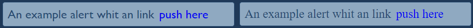

# GAME STATION

## Tabla de contenido

- [Descripción general](#Descripción-general)
  - [Indicaciones](#Indicaciones)
  - [Descripción del proyecto](#Descripción-del-proyecto)
  - [Nombre de la librería](#Nombre-de-librería)
  - [Versión del proyecto](#Versión-del-proyecto)
  - [Enlaces](#Enlaces)
  - [Que incluye](#que-incluye)
  - [Documentación](#Documentación)
  - [Implementación](#Implementación)
- [Procesos](#Procesos)
  - [Construido con](#Construido-con)
  - [Herramientas utilizadas](#Herramientas-utilizadas)
- [Desarrolladores](#Desarrolladores)

## Descripción general

## Indicaciones

- Desarrollar una librería tipo Bootstrap.

## Descripción del proyecto

- La página estará centrada en mostrar información acerca de juegos en actualidad y próximos a salir.

## Nombre de la librería

- Game Station

## Versión del proyecto

- versión 0.1

## Enlaces

- Repositorio URL: [GitHub](https://github.com/AlexanderPortillo/GameStation.git)
- Sitio en vivo URL: [GitHub Page]()

## Que incluye

Dentro de la descarga, encontrará los siguientes directorios y archivos, que agrupan lógicamente los activos comunes y brindan variaciones tanto compiladas como minimizadas y tambien encontrará un par de ejemplos demostrando de uso de la libreria.

<details>
  <summary>Ver contenido</summary>

```text
GameStation/
├── css/
│   ├── badges.css
│   ├── badges.css.map
│   ├── border-radius.css
│   ├── border-radius.css.map
│   ├── btn.css
│   ├── btn.css.map
│   ├── colors.css
│   ├── colors.css.map
│   ├── flexBox.css
│   ├── flexBox.css.map
│   ├── font-size.css
│   ├── font-size.css.map
│   ├── margin-padding-border.css
│   ├── margin-padding-border.css.map
│   ├── style.css
│   └── style.css.map
└── Html/
    ├── badges.html
    ├── buttons.html
    ├── cards.html
    ├── container.html
    └── row-col.html
```

</details>

## Documentación

| Clases            | Etiqueta      | unidad de medida | Descripción                       |
| ----------------- | ------------- | ---------------- | --------------------------------- |
| `alert`           | border-radius | px               | Nos permide redondear un elemento |
| `alert-warning`   | border-radius | px               | Nos permide redondear un elemento |
| `alert-succes`    | border-radius | px               | Nos permide redondear un elemento |
| `alert-succes`    | border-radius | px               | Nos permide redondear un elemento |
| `alert-link`      | border-radius | px               | Nos permide redondear un elemento |
| `alert-normal`    | border-radius | px               | Nos permide redondear un elemento |
| `badges`          | border-radius | px               | Nos permide redondear un elemento |
| `badges-indigo`   | border-radius | px               | Nos permide redondear un elemento |
| `badges-olive`    | border-radius | px               | Nos permide redondear un elemento |
| `badges-paynes`   | border-radius | px               | Nos permide redondear un elemento |
| `badges-red`      | border-radius | px               | Nos permide redondear un elemento |
| `circle-1 y -200` | border-radius | px               | Nos permide redondear un elemento |
| `circle-1 y -200` | border-radius | px               | Nos permide redondear un elemento |

## Ejemplos Implementación

<h1 align="center">Alerts</h1>


```Html
<span class="alert alert-warning" style="width: 450px">
    <i class="fas fa-exclamation-triangle"></i> An example alert whit warning icon
</span>

<span class="d-flex bg-flame color-red b-1 circle-5 p-10 font-size-px-25 gap-10"
    style="width: 450px; font-family: 'Gill Sans', 'Gill Sans MT', Calibri, 'Trebuchet MS', sans-serif;">
    <i class="fas fa-exclamation-triangle"></i> An example alert whit warning icon
</span>
```


```Html
<span class="alert alert-succes" style="width: 450px">
    <i class="far fa-check-circle"></i> An example alert whit succes icon
</span>

<span class="d-flex bg-dark-pastel-green color-forrest-green b-1 circle-5 p-10 font-size-px-25 gap-10"
    style="width: 450px; font-family: 'Gill Sans', 'Gill Sans MT', Calibri, 'Trebuchet MS', sans-serif;">
    <i class="far fa-check-circle"></i> An example alert whit succes icon
</span>
```



```Html
<span class="alert alert-link" style="width: 450px">
    An example alert whit an link
    <a href="#">push here</a>
</span>

<span class="d-flex bg-cadet-gray color-indigo-dye b-1 circle-5 p-10 font-size-px-25 gap-10"
    style="width: 450px; font-family: 'Gill Sans', 'Gill Sans MT', Calibri, 'Trebuchet MS' sans-serif;">
    An example alert whit an link
    <a href="#">push here</a>
</span>
```


```Html
<span class="alert alert-normal" style="width: 450px"> This is a normal alert</span>

<span class="d-flex bg-beaer color-chamoisee b-1 circle-5 p-10 font-size-px-25 gap-10"
    style="width: 450px; font-family: 'Gill Sans', 'Gill Sans MT', Calibri, 'Trebuchet MS' sans-serif;">
    This is a normal alert
</span>
```
<h1 align="center">Badges</h1>


```Html
<span class="badges b-2 circle-4 bg-indigo-dye color-coquelicot d-flex d-align-items-center d-justify-content-center">
    Insiginia roja
</span>

<span class="badges badges-indigo d-flex d-align-items-center d-justify-content-center">
    Insiginia roja
</span>
```


```Html
<span
    class="badges b-2 bg-olive color-selective-yellow d-flex d-align-items-center d-justify-content-center max-content circle-t-l-20 circle-t-r-15 circle-b-r-15"
    style="width: 150px;">
    Insignia dorada
</span>

<span class="badges badges-olive d-flex d-align-items-center d-justify-content-center max-content"
    style="width: 150px;">
    Insignia dorada
</span>
```


```Html
<span
    class="badges b-2 circle-4 bg-paynes-gray color-sandy-brown d-flex d-align-items-center d-justify-content-center max-content"
    style="width: 170px;">
    Insignia plateada
</span>

<span class="badges badges-paynes d-flex d-align-items-center d-justify-content-center max-content"
    style="width: 170px;">
    Insignia plateada
</span>
```


```Html
<span
    class="badges b-2 bg-paynes-gray color-red d-flex d-align-items-center d-justify-content-center max-content circle-t-l-20 circle-b-r-20 pointer font-style-italic box-s-id-h-px-15"
    style="width: 170px;">
    Insignia especial
</span>

<span
    class="badges badges-red d-flex d-align-items-center d-justify-content-center max-content pointer box-s-id-h-px-15"
    style="width: 170px;">
    Insignia especial
</span>
```
<h1 align="center">Buttons</h1>


```Html
<button
    class="btn font-w-bold font-style-italic color-old-gold bg-paynes-gray b-1 circle-b-l-15 circle-t-r-15 pointer box-s-pb-px-10 font-size-px-25 max-content btn-h"
    style="width: 150px; height: 60px;">
    <i class="far fa-paper-plane"></i>
    Enviar
</button>

<button class="btn btn-gold font-w-bold font-style-italic box-s-pb-px-10 font-size-px-25"
    style="width: 150px; height: 60px;">
    <i class="far fa-paper-plane"></i>
    Enviar
</button>
```


```Html
<button
    class="btn btn-h-x font-w-bold font-style-italic color-red bg-prusian-blue pointer circle-4 box-s-pb-px-10 font-size-px-25 max-content p-10"
    style="width: 180px; height: 60px;">
    <i class="fas fa-download"></i>
    Descargar
</button>

<button class="btn btn-prusian font-w-bold font-style-italic box-s-pb-px-10 font-size-px-25"
    style="width: 180px; height: 60px;">
    <i class="fas fa-download"></i>
    Descargar
</button>
```


```Html
<a href="#" target="_blank"
    class="btn d-center color-white bg-kelly-green pointer circle-4 box-s-pb-h-px font-size-px-20 max-content gap-4"
    style="width: 160px; height: 40px;">
    Sigueme en
    <i class="fab fa-github font-size-px-30"></i>
</a>

<a href="#" target="_blank" class="btn btn-kelly d-center box-s-pb-h-px font-size-px-20 gap-4"
    style="width: 160px; height: 40px;">
    Sigueme en
    <i class="fab fa-github font-size-px-30"></i>
</a>
```


```Html
<a href="#" target="_blank"
    class="btn center-content color-white bg-prusian-blue pointer circle-30 box-s-pb-px-30 max-content gap-4 b-8 box-s-cg-h-px-50"
    style="width: 40px; height: 40px;">
    <i class="fab fa-facebook-f font-size-px-30"></i>
</a>

<a href="#" target="_blank" class="btn btn-blue center-content box-s-pb-px-30 gap-4 box-s-cg-h-px-50"
    style="width: 40px; height: 40px;">
    <i class="fab fa-facebook-f font-size-px-30"></i>
</a>
```
<h1 align="center">Containers</h1>


## Procesos

## Construido con

- Marcado semántico HTML5
- Propiedades personalizadas de CSS
- Flex box
- Css Grid
- Diseño responsivo
- Sass
- Git

## Herramientas utilizadas

- [VSCode](https://code.visualstudio.com/)
- [Sass](https://sass-lang.com/)
- [Git](https://git-scm.com/)
- [GitHub](https://github.com/)
- [TinyPNG](https://tinypng.com/)
- [Font Awesome](https://fontawesome.com/)
- [Icons](https://iconos8.es/icons/set/ico)
- [Xtrafondos](https://www.xtrafondos.com/)
- [Color Hunt](https://colorhunt.co/)
- [Google Fonts](https://fonts.google.com/)
- [Víctor Mono](https://rubjo.github.io/victor-mono/)
- [Coolors](https://coolors.co/image-picker)

## Desarrolladores

- Denis Alexander Martel Portillo MP20002 - [AlexanderPortillo](https://github.com/AlexanderPortillo)
- Gerardo Alexander López Medrano LM20003 - [MedranoGerardo](https://github.com/MedranoGerardo)
- Jesse Antonio Miranda Pérez MP20049 - [Jesse-Miranda](https://github.com/Jesse-Miranda)
